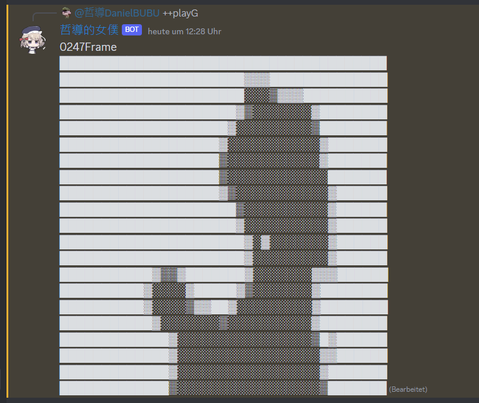
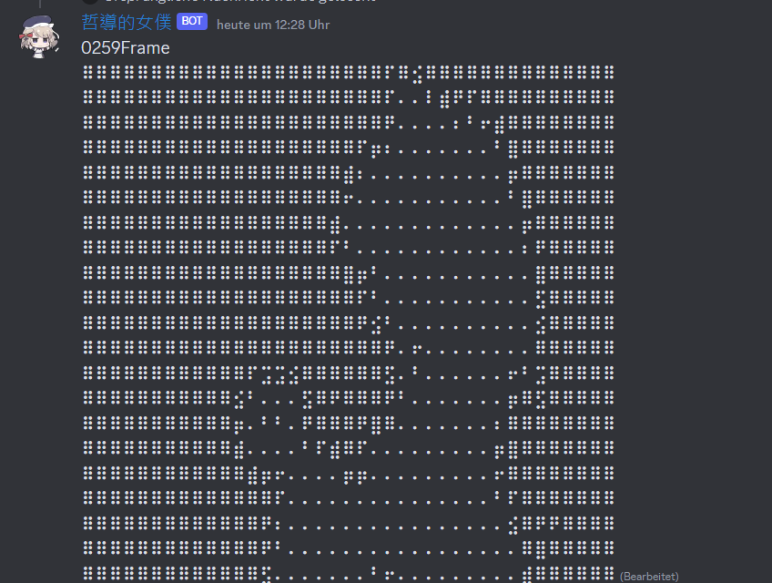

# TouhouBadAppleDiscord
 Play Badapple in discord text channel
 
 
 

## How to use
1. paste bot token in `configExample.json` and rename it to `config.json`
2. `npm i` and `node .` to run the bot
3. type `++playG` or `++playD` in text channel
4. Enjoy the voice in your brain

## Support/Bug report
- Discord:https://discord.gg/bGWZCShbea
- Support me here:https://www.buymeacoffee.com/DanielBUBU